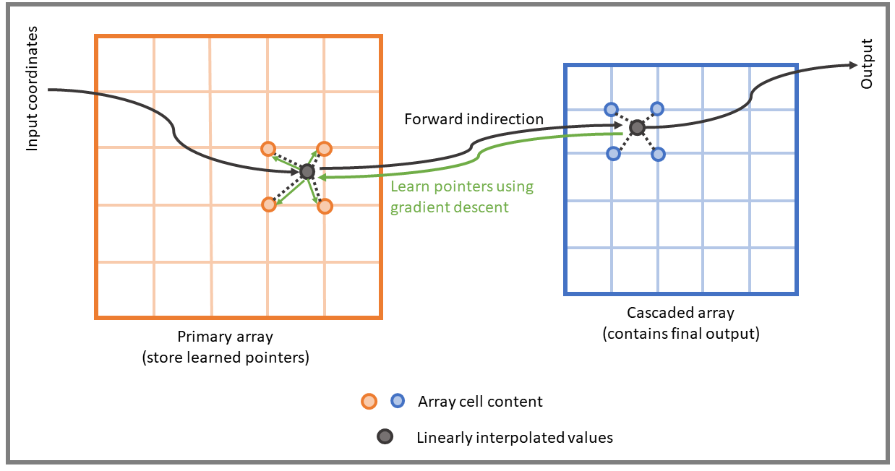

# Efficient Graphics Representation with Differentiable Indirection
### <i>In SIGGRAPH ASIA '23 Conference Proceedings</i>

[Webpage](https://sayan1an.github.io/din.html)

[Paper + Supplemental](https://arxiv.org/abs/2309.08387)

[Data](https://drive.google.com/drive/folders/1KzeMocc05YGGV26fezjCOzLik4GaNMK0?usp=sharing)

# Directory structure

```text
├── DifferentiableIndirection
│   └── disneyFit
│   └── imageCompression
├── DifferentiableIndirectionData
│   └── gBuffer
│   └── imageCache
├── DifferentiableIndirectionOutput
```

# Important files

* `DifferentiableIndirection/networksBase.py` -- Defines differentiable arrays `SpatialGrid2D, SpatialGrid3D, and SpatialGrid4D`.
* `DifferentiableIndirection/disneyFit/networks.py` -- Defines <i>Disney BRDF</i> approximation network.
* `DifferentiableIndirection/imageCompression/networks.py` -- Defines image compression networks with varying `2D, 3D, 4D` cascaded arrays.

# A simple <i>differentiable indirection</i> example

```
import networksBase as nb
import torch

class DifferentiableIndirection(torch.nn.Module):
    def __init__(self, primarySize, cascadedSize, torchDevice):
        super(DifferentiableIndirection, self).__init__()

        # initialize primary - gpu device, array resolutions, channel count, bilinear interpolation,
        # normalize o/p with non-linearity, scale initial content, initialize with uniform ramp - 'U'.        
        self.primary = nb.SpatialGrid2D(torchDevice, uDim=primarySize, vDim=primarySize,
                                      latent=2, bilinear=True, normalize=True, initScale=1, initMode="U")

        # initialize cascaded - gpu device, array resolutions, channel count, bilinear interpolation,
        # no o/p with non-linearity, scale initial content, initialize with constant value. 
        self.cascaded = nb.SpatialGrid2D(torchDevice, uDim=cascadedSize, vDim=cascadedSize,
                                      latent=1, bilinear=True, normalize=False, initScale=0.5, initMode="C")

    # Assumes x \in [0, 1)
    def forward(self, x):
        return self.cascaded(self.primary(x))
```

# Dependencies

* `torch`
* `numpy`
* `PIL`

# Training and evalution

Clone the repository and download the [training data](https://drive.google.com/drive/folders/10qHheWQ8AEs_5_L3d0DMbex20OP6Mqif?usp=sharing). Place the data in the directory structure as outlined above in the folder `DifferentiableIndirectionData`. Both training and evaluation output is accumulated in folder `DifferentiableIndirectionOutput`.

<b>Training <i>Disney BRDF</i> using cascaded-decoders of size 16.</b>
```
cd DifferentiableIndirection/disneyFit
../disneyFit>python .\train.py 16 16 16
```

<b>Evaluating <i>Disney BRDF</i> with a pre-trained network.</b>
```
cd DifferentiableIndirection/disneyFit
../disneyFit>python .\eval.py 16 16 16
```

<b>Training a 6x or 12x compressed image representation using `2D, 3D, and 4D` cascaded-array netwrok-configs.</b>
```
cd DifferentiableIndirection/imageCompression
python ./train.py 6 "Network_p2_c2_41" "6_0" -- 6x Compression, 2D Primary/2D Cascaded, image name 6_0
python ./train.py 6 "Network_p2_c3_321" "6_0" -- 6x Compression, 2D Primary/3D Cascaded, image name 6_0
python ./train.py 6 "Network_p2_c4_401" "6_0" -- 6x Compression, 2D Primary/4D Cascaded, image name 6_0
python ./train.py 12 "Network_p2_c2_41" "6_0" -- 12x Compression, 2D Primary/2D Cascaded, image name 6_0
python ./train.py 12 "Network_p2_c3_321" "6_0" -- 12x Compression, 2D Primary/3D Cascaded, image name 6_0
python ./train.py 12 "Network_p2_c4_401" "6_0" -- 12x Compression, 2D Primary/4D Cascaded, image name 6_0
```

<b>De-compressing a pre-trained image.</b>
```
cd DifferentiableIndirection/imageCompression
python ./eval.py 6 "Network_p2_c4_401" "6_0"
```
# Official repository and license
Based on official open-sourced version released under Creative Commons NC 4.0 license.

Link to [official repository](https://github.com/facebookresearch/differentiable-indirection).

